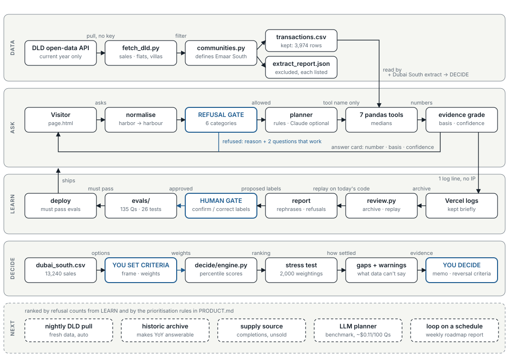

# Dubai RE Intelligence

Ask Dubai property-sales data a question in plain English. The answer comes back with where the number came from and a confidence grade. When the data cannot support the question, it refuses and says why.

**▶ Live: [dubai-re-intelligence-seven.vercel.app](https://dubai-re-intelligence-seven.vercel.app)** · real Dubai Land Department sales, Jan–Sep 2026 · no login, no API key

**▶ Decide:** [the Dubai South decision workbench](https://dubai-re-intelligence-seven.vercel.app/decide): say what you're deciding in your own words ("I have 4–5M, I need to sell in 3 years, leave Expo out"). It frames the decision, ranks projects on 13,240 real sales, says how settled the answer is, and lists what to verify. It never picks. The full table and sliders are one click away in the [evidence view](https://dubai-re-intelligence-seven.vercel.app/decide/evidence).

**Product thinking:** [PRODUCT.md](PRODUCT.md) covers the decision it serves, requirements, the evidence contract, what was cut, how it is measured, the decision log and what's next.

Built by Pavan Raheja while leading investment and strategy at Dash Capital (Dubai) — **[see my work & get in touch → pavan.blog/work](https://www.pavan.blog/work?utm_source=github&utm_medium=readme&utm_campaign=dubai-re-intelligence)**.

## At a glance

| | |
|---|---|
| **Data** | 3,974 real residential sales across Emaar South and Dubai Creek Harbour, pulled from the land department's open-data API by a script (`pipeline/fetch_dld.py`). Every exclusion is listed in `pipeline/extract_report.json` |
| **Answers** | Seven pandas tools: one-community snapshot, compare communities, monthly price and volume trend (one community, or both side by side, never pooled), breakdown (bedrooms, property type, off-plan vs ready, project), notable deals (latest or largest), data coverage |
| **Refuses** | Forward-looking, causal, advice, out-of-scope, supply/absorption, and areas outside the extract |
| **Measured** | 135 labelled questions in five sets, 9 of them typed on the live site. **First contact on 40 independently written questions: 34/40 (85%). On 30 everyday questions: 18/30 (60%)**, with no wrong refusals but 12 wrong views. After fixes all sets pass (tuned) · 0 missed refusals |
| **Tests** | 15 unit tests on refusal and evidence behaviour · 12 on the decision engine · 11 on the conversation layer |

## Architecture



Solid = built, dashed = roadmap. Numbers only come from pandas. Two gates: the **refusal gate** runs before any planning, and the **human gate** runs before any change to the eval set. There is no database: the extract is a versioned CSV, so any answer can be reproduced from a commit. Regenerate with `python docs/make_architecture.py`.

## Run it

```bash
pip install -r requirements.txt
python api/index.py                 # web UI → http://localhost:8090
python ask.py "compare the two communities"
python ask.py --demo                # the full question set, including the ones it refuses
python evals/run_eval.py            # score every labelled question
python ask/test_ask.py              # 15 unit tests
python pipeline/fetch_dld.py        # re-pull the real data (1 Jan this year → today)
python pipeline/fetch_dubai_south.py  # project-level Dubai South extract for the workbench
python decide/test_decide.py        # 12 tests: thin projects never ranked, budget, stress, gaps
python decide/test_converse.py      # 11 tests: understands budgets and priorities; never writes a number the engine didn't produce
python insights/review.py           # read live logs → rephrase chains, refusal demand, eval candidates
```

## `ask/` — the question layer

You ask in plain English. A planner picks which pandas tool runs, and the tool returns the number **with its provenance, a confidence grade, and an explicit refusal when the data cannot support the question.**

No API key is needed: the default planner is rule-based. Set `ANTHROPIC_API_KEY` and Claude picks the tools instead. **The numbers and the refusals are the same either way**, because the model only chooses which tool runs. It never produces a number and it cannot override a refusal.

**Example (real data)**

```
Q: Is Emaar South absorbing supply faster than Dubai Creek Harbour?

  x REFUSED: supply question — absorption needs units delivered and unsold stock;
             DLD sales records only show the demand side. I can show deal volume,
             which is not absorption

  What I can show instead (this does NOT answer the question asked):

[compare_communities]
  Dubai Creek Harbour     2824 txns · median AED 2566.9/sqft · YoY n/a · off-plan 71.1%
  Emaar South             1150 txns · median AED 1627.7/sqft · YoY n/a · off-plan 86.6%
  Basis: 3,974 rows · Jan 2026–Sep 2026 · DLD open data, real sales · pulled 2026-09-27
  Confidence: MEDIUM
    ! off-plan share differs (Dubai Creek Harbour 71% vs Emaar South 87%) — not
      like-for-like; price gap is partly product mix, not market
    ! Dubai Creek Harbour: no prior-period rows in this extract (starts Jan 2026)
      — year-on-year not computed
```

**What it refuses, and why**

| Refusal | Reason |
|---|---|
| Forward-looking ("will", "heading", "forecast", "2027") | The source is transaction history. It contains no forward data. |
| Causal ("why", "what drove", "behind") | Transactions show association, not cause. |
| Advice ("should I buy", "overpriced", "good value") | A judgement the data cannot make. It shows the numbers the judgement would use. |
| Out of scope (rents, yields, mortgages, service charges, population) | Not in DLD sales records. |
| Supply / absorption (inventory, unsold, handovers) | Absorption needs units delivered and unsold stock. Sales records are the demand side only. |
| Any other area (Downtown, Marina, JVC… plus all 224 registry area names) | Answering with these two communities would answer a different question. |
| Thin sample (smallest group < 30 rows) | No answer is given at all, not a low-confidence one. |

**What it downgrades rather than refuses**

- **Not like-for-like:** if off-plan share differs by more than 15 points, it says the price gap is partly product mix, not market.
- **Missing prior period:** year-on-year is reported as *not computed*, never estimated.
- **Stale data:** a window ending more than 180 days ago is flagged, and HIGH drops to MEDIUM.
- **Thin months and segments:** months with fewer than 5 deals are dropped from trends, and segments under 30 sales are flagged. Both are reported.

Every threshold is a named constant in `ask/evidence.py`, so the rules are arguable rather than buried. An answer without stated failure conditions is a story, not a finding.

## `evals/` — how it is measured

- `questions_v1.jsonl`: 33 **dev** questions (the rules were tuned on these) and 23 **holdout** questions (written at the same time, never tuned on).
- `questions_independent_v1.jsonl`: 40 questions written by a separate model that saw only a description of the tool, not the code. They were committed before the first run (see git history).
- **Baseline before this round:** dev 58%, holdout 52%, with 21 questions answered that should have been refused.
- **Independent first contact: 34/40 (85%).** Its misses included a real bug, where `rent` matched inside "cu*rrent*". It is fixed and has a regression test. The set now scores 40/40, but that number is tuned; the next clean number needs a new independent set.
- `questions_everyday_v1.jsonl`: the **first question typed on the live site** ("what is going on with Dubai creek harbor", which got a generic table) plus 30 everyday phrasings. **Baseline: 18/30.** Nothing was wrongly refused, but 12 went to the wrong view, which feels like a refusal to the person asking. Now 30/30 after adding a community snapshot, notable deals, project and off-plan splits, and spelling tolerance.
- **Second live session (28 Sep):** "price trend in both" returned a single pooled line at HIGH confidence. Pooling hid that the two communities moved in opposite directions. The planner now never pools them, and a regression test enforces it.
- The error that matters is the **missed refusal**, a confident number that should not exist. It is reported separately from over-refusal.

## `decide/` — the decision workbench

`/decide` frames an allocation decision in Dubai South (budget, stage, whether Expo City is in the mandate), lets the decision-maker set criteria weights, and returns a ranking with, for every project, its evidence, confidence, how often it comes first across 2,000 resampled weightings, and the gaps the sales data cannot fill. The person picks and writes a memo with reversal criteria.

**The conversation layer** (`decide/converse.py`) turns plain language into a frame and priorities, handles what-ifs ("what if growth matters more?" reports what changed), comparisons, and "why X". **Words can be generated; numbers cannot:** every number in a reply must appear in the engine's output, a test enforces it, and the optional Claude writer (set `ANTHROPIC_API_KEY`) is held to the same check, falling back to a template if it writes a number the engine didn't produce.

The data forced two honest relabels: 94% of 2026 sales are developer first-sales and resales are 0.7%, so "liquidity" is really *demand, as a proxy*; and nine months of prices make momentum mostly noise, so it is scored on the lower end of its 90% interval. See [PRODUCT.md](PRODUCT.md#the-decision-it-supports-where-to-allocate-in-dubai-south).

## `insights/` — the learning loop

Every question asked on the live site is logged as one structured line: the question and what the tool did, with no IP and nothing that identifies the visitor. `python insights/review.py` then:

1. **archives** new questions locally (Vercel keeps logs briefly; the archive makes it cumulative);
2. **replays** each one against the current code, showing what the visitor saw then and what they would see now;
3. **flags rephrase chains** (a typed question followed within 2 minutes by another sharing a word). People rephrase when the answer missed;
4. **counts refusals as demand** and maps each category to the roadmap item that would turn it into an answer;
5. **proposes** new typed questions as eval candidates with a *suggested* label.

It never changes a rule, threshold or eval label by itself. A public text box that rewrote its own rules could be steered by anyone typing into it, so the loop proposes and a person approves. See [`insights/sample_report_2026-09-28.md`](insights/sample_report_2026-09-28.md): run on the owner's own sessions, it flagged the exact chain that exposed the pooled-trend bug, from timing and shared words alone. Visitors' questions stay out of git.

## `pipeline/` — where the data comes from

- `fetch_dld.py` pulls residential sales from the land department's open-data API (the endpoint behind [dubailand.gov.ae/en/open-data/real-estate-data](https://dubailand.gov.ae/en/open-data/real-estate-data/)). It keeps market sales of flats and villas and drops developer bulk registrations, hotel apartments, land and price-per-sqft outliers, counting each drop.
- `communities.py` defines each community. The registry has no "Emaar South", so it is defined by project name. The first pull's exclusion report caught Grove Ridge and Vista Ridge, which would have been a 30% undercount.
- **Limit:** the public API serves the current calendar year only, so the extract starts 1 Jan 2026.
- `market_scan.py` scans candidate markets before anything is built for them. Its 2026 output: Business Bay has about a quarter of Dubai South's sales but 45% are resales or ready sales (vs 6%); Downtown (registry "Burj Khalifa") 71%; Dubai Islands (registry "Palm Deira") 0%.

## Other tools in this repo

### `dashboard/` — DLD Transaction Intelligence
A Flask + Pandas dashboard focused on the same two communities. It auto-normalises two DLD export formats and runs on the committed real extract. If that file is missing, it falls back to **synthetic** demo data (`dashboard/generate_demo_data.py`), which is labelled as synthetic wherever it is shown.

```bash
cd dashboard && python app.py      # http://localhost:8085
```

### `weekly-snapshot/` — Investor Weekly Snapshot
A dark-mode weekly snapshot of Dubai market performance: value (AED bn), deals and off-plan share, from public DLD reporting.

```bash
cd weekly-snapshot && python server.py   # http://localhost:8000
```

## Design notes

- **Focus over breadth.** Two communities that drive real decisions. A generic "all of Dubai" view was rejected: vanity breadth with little decision value.
- **The model chooses the question, never the answer.** Numbers are computed, not generated, and the evidence rules can veto the planner.
- **Reproducible, not curated.** One command re-pulls the data, and one command re-scores every question.
- **A demo that needs a secret is not a demo.** The public link runs the rules planner: $0 per question, and no key to leak.

## License

MIT
